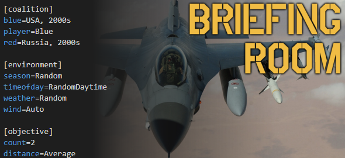

----
**Try the <a href="https://dcs-briefingroom.com/">Web version</a> now!**
## Installation
 App is generally standalone .exe with caveats on desktop:
 1. Desktop version requires [WebView2 Runtime](https://go.microsoft.com/fwlink/p/?linkid=2124703) this may not be installed on windows by default. If Web Exe works and Desktop doesn't this is likely the issue.
 1. Desktop won't run if placed within `Program Files` or `Program Files (x86)` (Its a Microsoft issue not us :D)

## What is BriefingRoom for DCS World?

BriefingRoom for DCS World is a massively improved version of DCS World's own fast mission generator. BriefingRoom allows you to create complete scenarios in just a few clicks. Missions generated with BriefingRoom tend to be rather "player-centric". Their purpose is not to simulate a real war theater, like Falcon 4's dynamic campaign, but to provide the player(s) with interesting objectives and challenges. This approach is a perfect fit for DCS World's limited number of units and very capable scripting engine.

While BriefingRoom is designed to be easy to use and to allow the creation of missions in mere seconds, it is also heavily moddable and will give many options to power users ready to tackle with its most advanced features.

**Not interested in the source code? Get the latest version from the project website and begin creating missions right now: [akaagar.itch.io/briefing-room-for-dcs](https://akaagar.itch.io/briefing-room-for-dcs/)**

BriefingRoom is free and open source and will always remain so, but if you want to support its development, you can make a one-time or monthly donation.

Hosting costs: or <a href="https://www.patreon.com/bePatron?u=99514930" data-patreon-widget-type="become-patron-button">Become a member!</a>

Original Creator: 

### Features summary

* Can generate any kind of single-player or multiplayer mission, from deep strikes behind a hostile superpower's cutting-edge integrated air defense network to photo reconnaissance flights over a terrorist training camp.
* Choose from a large variety of mission types, from combat air patrols to bomber interception, target designation for artillery strikes, photo reconnaissance, bomb damage assessment and many others, or create your own by picking target types, players tasking, and various objective and mission features.
* Extremely easy to use: generate missions in seconds without any technical knowledge, then export them to a DCS World .MIZ file in just a few clicks.
* Automatically generates proper friendly/enemy units according to countries and time period, but also able to create "what if" scenarios (2010s USAF vs 1940s Luftwaffe) and freely choose player aircraft in any country/time period.
* Generated mission can include custom scripts for various effects (advanced SAM AI, JTAC smoke and laser designation, artillery strikes...)
* Save mission templates to small template files and share them with your friends.
* Easily moddable to add more countries, units and scenarios
* Available as both a graphical user interface for ease of use and as a command-line tool for batch mission generation
* Customize enemy SAM and air-to-air opposition for any mission difficulty.
* No units spawned through runtime scripting. All units are  to the mission itself, so they can be edited with DCS World's mission editor for further customization.
* **Please read the user's manual and the modder's manual for more information**

### Included Scripted systems (Thanks to them)

* Skynet IADS by walder
* Splash Damage 2.9 by spencershepard (GRIMM)
* CSAR (ciribob)
* CTLD (ciribob)

### Call for Contributions

We are always looking for contributors to keep us up to date with the latest DCS content. You don't need any technical skill and we are always happy to help. Areas we are looking for help to improve:

* Aircraft Loadouts
* Implementing Mod Units
* Write better descriptions and briefing parts
* Updating vehicle/unit operators & liveries
* Keeping map data upto date
* Creation of coalitions
* Creation of map situations

### Kneeboard Image errors

The generation of Kneeboard images has been prone to issues. While we aim to fix as many as possible odd issues get through. Check or try some of these previous solutions:

* Check your running the latest version from github. Try the latest beta.
* Use Web version to see more detailed error message in the console terminal.
* Check the image.win.exe file is in the right location.
* Turkish OS users (and others who use `ı`) rename file from `image.win.exe` to `ımage.win.exe`

### Additional information

* Created by Ambroise Garel (@akaAgar), maintained by John Harvey (@john681611)
* Released under the [GNU General Public License 3.0](https://www.gnu.org/licenses/gpl-3.0.en.html)
* Project website: [akaagar.itch.io/briefing-room-for-dcs](https://akaagar.itch.io/briefing-room-for-dcs/)
* Source code repository: [github.com/akaAgar/briefing-room-for-dcs](https://github.com/akaAgar/briefing-room-for-dcs)

[Credits](Include/Markdown/Manuals/Credits.md)

### Docker
Build

    docker build -t johnharvey/dcs-briefing-room-web:latest .

Run responding on port localhost:5000 

    docker run --rm -it -p 5000:80 -e ASPNETCORE_HTTP_PORTS=80  johnharvey/dcs-briefing-room-web:latest

## Changelog
**Changelog is no longer maintained manually please use [github](https://github.com/akaAgar/briefing-room-for-dcs/releases)**
